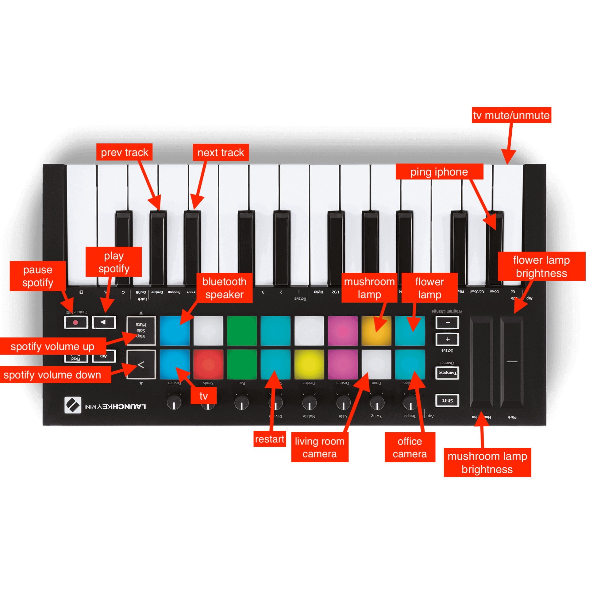

# home midi controller

control your home with a midi controller don't let your dreams be dreams

Additionally:

- If internet is unreachable, all finger pads will turn red and any pad press will cause service restart
- If there's an active device in Spotify, pressing play will resume playback on the active device
- Any command that takes a couple seconds (bluetooth, camera on/off, etc.) will go into a flashing blue pending mode then once the command succeeds, settle to a on (green) or off (pink) state.
- During iPhone ping, all finger pads will flash random colors and be unpressable for 20 seconds
- Flashing status mode (red = disconnected, green = connected, yellow = indeterminate) can be accessed in shift mode
